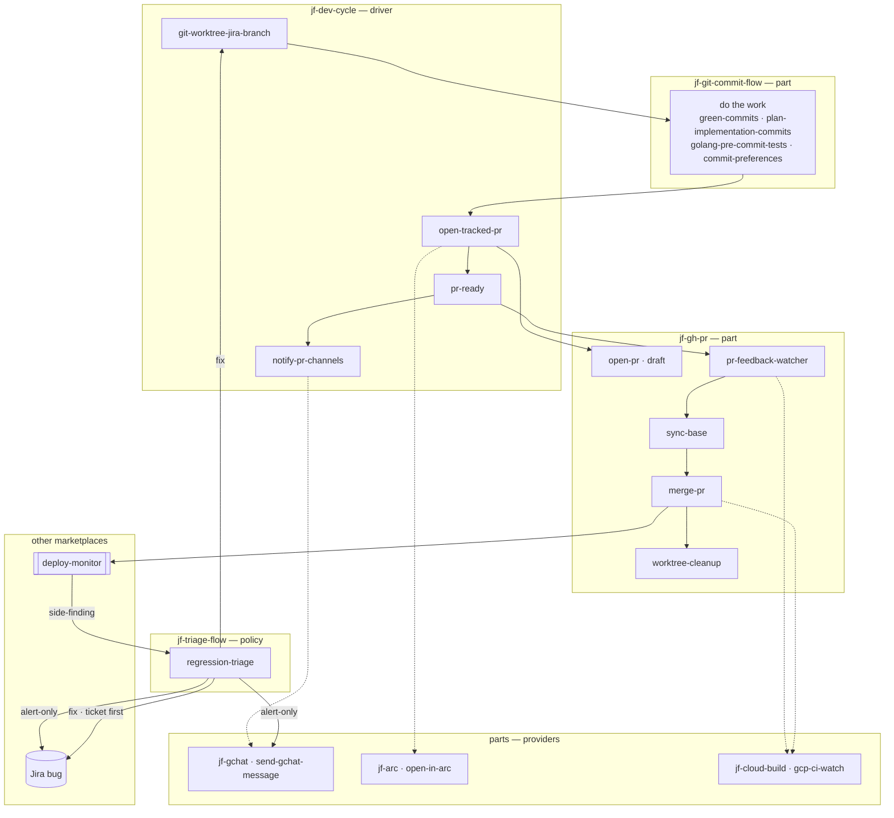

# Personal skills (all repos)

**Location:** `~/.claude/skills` (this directory).

## Layout

This directory holds two kinds of thing side by side, and Claude Code loads both:

- **Plugin directories** — a `jf-*` directory containing `.claude-plugin/plugin.json`
  and one or more `skills/<skill>/SKILL.md`. Each auto-loads as `<plugin>@skills-dir`,
  and its skills are addressed **`jf-<plugin>:<skill>`**.
- **Plain skill directories** — a directory containing `SKILL.md` directly. These
  stay unpackaged and are addressed by their **bare name**.

Keeping the plugins here rather than in a parallel tree means one location serves
both the local edit loop (through this symlink) and publication.

## Plugins

Sorted by what each is *for*, not by topic. **Parts** and **providers** do one job
and declare no dependencies, so they can be taken in isolation. The **policy**
plugin carries portable judgement. The **driver** is the assembly, and is the only
one that binds the others together.

| Plugin | Kind | Skills |
|---|---|---|
| `jf-gchat` | part — provider (comms) | send-gchat-message |
| `jf-arc` | part — provider (browser) | open-in-arc |
| `jf-cloud-build` | part — provider (CI) | gcp-ci-watch |
| `jf-git-commit-flow` | part | green-commits, commit-preferences, plan-implementation-commits, golang-pre-commit-tests |
| `jf-gh-pr` | part | open-pr, merge-pr, pr-feedback-watcher, sync-base, worktree-cleanup |
| `jf-triage-flow` | policy | regression-triage |
| `jf-dev-cycle` | driver | git-worktree-jira-branch, open-tracked-pr, pr-ready, notify-pr-channels |
| `jf-feats-of-merit` | part | wsu, wsu-note |

**Unpackaged, staying local:** `vim-rest`, `user-preferences`, `temporal-activities`,
and `pr-studio-open-in-arc` (which belongs upstream in `vendasta-pr-studio`).

One further directory here holds a **retired** skill: nothing fires it
automatically any more, because the harness now creates a worktree at session
start and that was its distinguishing job. It stays on disk so it can still be
invoked deliberately.

## For the AI

At the start of any **coding task** (implementing a plan, refactor, or multi-step
change), read and apply the skills here. Do not wait to be reminded. Key ones:

| Skill | When to apply |
|-------|----------------|
| **jf-git-commit-flow:plan-implementation-commits** | When **implementing a plan** (RFC, sprint tasks, multi-step job). Make **small logical commits** and **push to the feature branch as you go** — after each step or todo. Never do all work then one commit at the end. |
| **jf-git-commit-flow:green-commits** | Whenever you write or change code. Commit and **push** in small, green increments **as you go**. Never do all work then one commit at the end. |
| **jf-git-commit-flow:commit-preferences** | When writing commit messages: Conventional Commits (feat, fix, refactor, …) and the user's preferred types/scopes. |
| **jf-git-commit-flow:golang-pre-commit-tests** | Before committing in a Go repo: run the full internal test suite (e.g. `go test ./internal/...`) so commits are green. |
| **user-preferences** | When editing Go: match struct/map/comment alignment so the user's editor (e.g. vim) doesn't rewrite your changes. |
| **jf-gh-pr:open-pr** | Opening a pull request: always draft, fill the repo PR template. No tracker link and no browser step — those live in `open-tracked-pr`. |
| **jf-dev-cycle:open-tracked-pr** | Opening a PR for ticket-tracked work: delegates the open to `open-pr`, then prepends the Jira link and shows it in Arc. |
| **jf-dev-cycle:pr-ready** | Marking a PR ready for review: un-draft, append `@vendasta/meerkats` to the body, then hand off the Chat post. |
| **jf-dev-cycle:notify-pr-channels** | Build passed, or notifying the team: personal team PR channel (@Craig & @Daniel) plus any `@vendasta/<team>` channel named in the PR body. Owns the message shape; delegates delivery. |
| **jf-gchat:send-gchat-message** | Low-level primitive: post to any Chat space/team, resolving space IDs, `@vendasta/<team>` handles and slugs. Owns Chat auth and the team→space map. |
| **jf-triage-flow:regression-triage** | A side problem looks like a regression from an earlier PR: attribute it to the introducing PR (confirm-gate — first blame is often wrong), then route to **alert** the owning team or **fix** it. |
| **jf-cloud-build:gcp-ci-watch** | Watching CI for a branch when GitHub's rollup lags: poll Cloud Build directly and report green/failure. |
| **jf-feats-of-merit:wsu** | Creating a Weekly Status Update page: compute the title, gather from GitHub/Chat/git, run the questionnaire, create the Confluence page. |
| **jf-feats-of-merit:wsu-note** | Capturing a WSU-worthy moment mid-week. Appends a timestamped note for `wsu` to pick up. |

**Refactors:** Use at least 2–3 commits: (1) add new code + tests → commit & push,
(2) switch callers to new code → commit & push, (3) remove old code → commit & push.
See `jf-git-commit-flow`'s `green-commits` and `plan-implementation-commits`.

## Skill flow — which kicks off which

How the develop → ship → deploy → triage skills chain together, grouped by the
plugin that owns each. A **dashed** edge is a capability the caller degrades
without rather than one it requires; a solid edge is the flow itself.

**Cursor:** If these skills are not being applied in new chats, enable **Agent Skills**
in Cursor Settings → Rules (Import Settings), or add the key rules as **User Rules**
in the same place so they are always in context.
