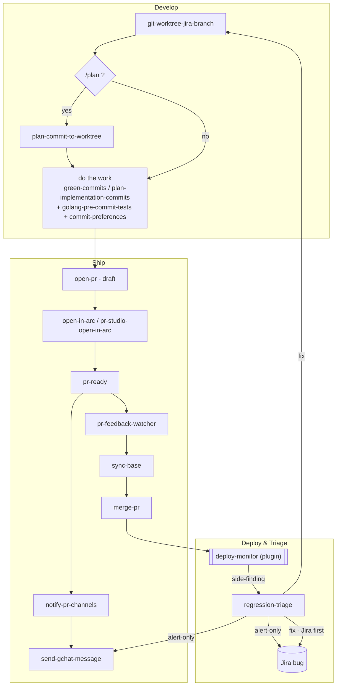

# Personal skills (all repos)

**Location:** `~/.claude/skills` (this directory).

**For the AI:** At the start of any **coding task** (implementing a plan, refactor, or multi-step change), read and apply the skills in this directory. Do not wait for the user to remind you. Key skills:

| Skill | When to apply |
|-------|----------------|
| **plan-implementation-commits** | When **implementing a plan** (RFC, sprint tasks, multi-step job). Make **small logical commits** and **push to the feature branch as you go**—after each step or todo. Never do all work then one commit at the end. |
| **green-commits** | Whenever you write or change code. Commit and **push** in small, green increments **as you go**—after each logical step. Never do all work then one commit at the end. |
| **user-preferences** | When editing Go: match struct/map/comment alignment so the user’s editor (e.g. vim) doesn’t rewrite your changes. |
| **commit-preferences** | When writing commit messages: use Conventional Commits (feat, fix, refactor, etc.) and the user’s preferred types/scopes. |
| **golang-pre-commit-tests** | Before committing in a Go repo: run the full internal test suite (e.g. `go test ./internal/...`) so commits are green. |
| **open-pr** | When opening a pull request: always create as draft, include Jira link, fill PR template. |
| **pr-ready** | When marking a PR ready for review: un-draft, add `vendasta/meerkats` reviewer, append `@vendasta/meerkats` to body, post in team GChat PR channel. |
| **notify-pr-channels** | When a build passes or notifying the team: post to personal team PR channel (AT Craig & Daniel) and any `@vendasta/<team>` channels in the PR body. Delegates delivery to **send-gchat-message**. |
| **send-gchat-message** | Low-level primitive: post a message to any Google Chat space/team, resolving space IDs / `@vendasta/<team>` handles / slugs. Owns Chat auth + the `TEAM_CHANNELS` map. Used by notify-pr-channels and regression-triage. |
| **regression-triage** | When a side problem (e.g. from **deploy-monitor**) looks like a regression from an earlier PR: attribute it to the introducing PR (confirm-gate — first blame is often wrong), then route to **alert** the owning team or **fix** it (hands off to the dev flow below). |
| **gcp-ci-watch** | When watching CI/CD for a branch: poll GCP Cloud Build directly (not GitHub checks). Report green/failure. Only merge if explicitly asked. On failure, always diagnose logs, fix, push, and re-watch — don't wait to be asked. |
| **wsu** | When creating a new Weekly Status Update page: compute the correct title, gather data from GitHub/GChat/git, run the questionnaire, and create the Confluence page. |
| **wsu-note** | When the user wants to capture a WSU-worthy moment mid-week. Appends a timestamped note to the weekly file for `/wsu` to pick up at compile time. |

**Refactors:** Use at least 2–3 commits: (1) add new code + tests → commit & push, (2) switch callers to new code → commit & push, (3) remove old code → commit & push. See **green-commits/SKILL.md** and **plan-implementation-commits/SKILL.md** for details.

## Skill flow — which kicks off which

How the develop → ship → deploy → triage skills chain together. `deploy-monitor`
lives in the `vendasta-dev-agent-toolkit` plugin; everything else is in this dir.
This is the chain `regression-triage`'s fix branch hands back into.

**Cursor:** If these skills are not being applied in new chats, enable **Agent Skills** in Cursor Settings → Rules (Import Settings), or add the key rules as **User Rules** in the same place so they are always in context.
