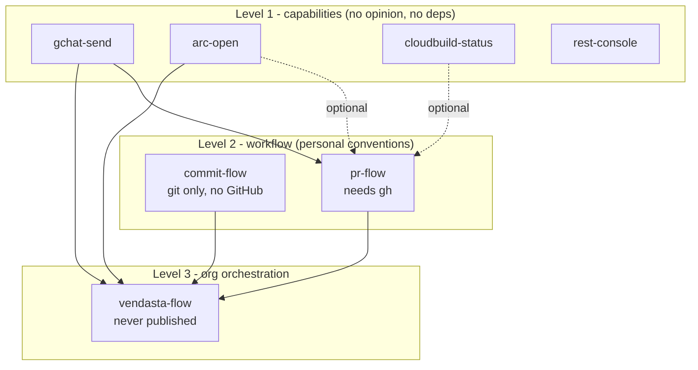

# Claude Skill Plugin Packaging - Plan

## Goal Capsule

**Objective.** Repackage the 23 personal skills in `claude/skills/` as layered Claude Code plugins published from one personal marketplace, split by level — pure capability, opinionated workflow, org orchestration — so teammates can install a layer without inheriting the opinions above it, and a generic subset can be extracted publicly later.

**Product authority.** This plan owns the packaging structure: how many marketplaces, what level each skill belongs to, how plugins depend on each other, and how org-specific configuration separates from portable skill logic. It does not own skill content; no skill body is rewritten beyond moving hard-coded identifiers behind configuration.

**Open blockers.** Three items block planning: final skill-to-plugin membership within the settled level structure, whether the marketplace lives in `benjfactor/dotfiles` or a dedicated repo, and the naming scheme. See Outstanding Questions.

## Product Contract

### Summary

Publish the personal skills as seven plugins from a single marketplace, organized primarily by level rather than by topic: capability plugins wrap one external tool with no workflow opinion, workflow plugins carry personal conventions on top of them, and one org plugin orchestrates across everything. Org identifiers move behind `userConfig` so the lower layers become publishable without a restructure.

### Problem Frame

The skills currently live in `claude/skills/` and reach Claude Code through a symlink at `~/.claude/skills`. That gives version control and a fast edit loop but distributes nothing: a teammate cannot install a skill, there is no version to pin, and there is no update path. Moving to a new machine made the seams visible.

The skills are densely interlinked — 13 of 23 reference at least one other by name, and `regression-triage` reaches eleven — so any split has to survive that graph rather than cut across it. They are also unevenly opinionated. `send-gchat-message` is a reusable primitive that posts to a Chat space; `notify-pr-channels` is a personal convention about which channels a passing build should reach. Packaging them together forces anyone who wants the primitive to adopt the convention.

### Key Decisions

- **One marketplace, many plugins.** (session-settled: user-approved — chosen over several marketplaces: marketplaces split on trust and ownership, there is one owner, and adding a marketplace is the only friction a consumer ever pays.) Governs R1.
- **Layered plugins using `dependencies`.** (session-settled: user-directed — chosen over a single all-in plugin and over a dependency-free split: the base-and-extension shape is the goal, and the mechanism exists.) Governs R2, R6.
- **Level is the primary split; surface is secondary.** (session-settled: user-directed — chosen over slicing by integration surface alone: surface grouping put opinionated conventions next to the primitives they wrap, and a consumer who wants a primitive should not inherit the convention above it.) Governs R3, R4, R5.
- **Token cost is not a splitting criterion.** Measured always-on cost across all 23 skills is ~1,840 tokens, roughly twice the ecosystem median for one plugin and below its 90th percentile. The split buys selective adoption and publishability, not weight.
- **Optional surfaces stay optional in prose, not in manifests.** Claude Code has no peer or optional dependency, so a hard `dependencies` entry would over-require a consumer whose CI or browser differs. Governs R7.
- **Descriptive plugin names over evocative ones.** Plugin names are the human-facing install decision; the model matches on skill names and descriptions. Governs R8.

The settled level structure, with dashed edges marking optional dependencies the manifest cannot express:

### Requirements

**Distribution shape**

- R1. All personal plugins publish from a single marketplace; a second marketplace is added only when a genuinely different trust or ownership boundary appears, such as a public subset under a separate owner.
- R2. Plugins layer through `plugin.json` `dependencies`, so a lower-level plugin installs without pulling in the levels above it.

**Level structure**

- R3. Each plugin sits at exactly one level: capability, workflow, or org orchestration.
- R4. A capability plugin wraps one external tool, carries no workflow opinion, and declares no dependency on another personal plugin.
- R5. A workflow plugin holds personal conventions and depends on the capability plugins whose tools it uses, so a consumer can adopt the capability without the convention built on it.
- R6. Dependency edges point from higher levels to lower levels only; no capability plugin depends on a workflow plugin.
- R7. Where a workflow plugin's use of a capability is optional, it does not declare a hard dependency on that capability's plugin. This covers Cloud Build status for `merge-pr` and `pr-feedback-watcher`, and Arc for `open-pr`.
- R8. Each plugin name describes what it owns, and no name collides with a name in a marketplace already added on this machine. An unprefixed `github` is excluded on that basis.

**Portability**

- R9. The `commit-flow` workflow plugin assumes git only and invokes no GitHub tooling, so it is usable on a non-GitHub remote. Skills that shell out to `gh` sit in `pr-flow` instead, including `sync-base` and `worktree-cleanup`.
- R10. Org-specific identifiers move behind `userConfig` rather than remaining literal in skill bodies or bundled scripts. This covers the Chat space ID `AAAAIj8WMWc`, the `@vendasta/meerkats` handle, and the `TEAM_CHANNELS` map.
- R11. Each plugin records which of its skills require org-internal configuration, so a plugin can be published without shipping internal defaults.

**Development workflow**

- R12. Skills stay editable in place during development, with no reinstall step between an edit and the next session using it.
- R13. Marketplace and plugin manifests pass `claude plugin validate --strict` before release.

### Key Flows

- **Adopting one capability without the workflow above it.** Trigger: a teammate wants to post to a Chat space from Claude Code but does not want personal PR conventions. Steps: they add the marketplace, install `gchat-send`, and configure their own space ID via `userConfig`. Outcome: no workflow plugin is installed, and `notify-pr-channels` never enters their context. Covers R4, R5, R10.
- **Adopting the full personal flow.** Trigger: a teammate wants the whole ship chain. Steps: they install `pr-flow`, which auto-installs `gchat-send` per R2, and optionally add `cloudbuild-status` and `arc-open`. Outcome: the chain works, and the two optional capabilities degrade in prose when absent. Covers R2, R7.

### Scope Boundaries

- Skill bodies are not rewritten. The only content change in scope is moving hard-coded org identifiers behind configuration per R10.
- Nothing is published publicly in this pass. R10 and R11 make publication possible later; they do not perform it.
- Whether `temporal-activities` and `pr-studio-open-in-arc` should instead go upstream into the Vendasta marketplace is not decided here. Both overlap plugins that already exist there.
- Release automation beyond R13's validate step is out of scope.

### Dependencies / Assumptions

- Claude Code 2.1.251 accepts `dependencies` in `plugin.json` as an array of strings, auto-installs them, and prunes orphans via `claude plugin prune`. Verified by schema probe against the installed binary.
- `peerDependencies` is not supported; the validator reports it as an unknown field ignored at load time. This is why R7 exists.
- A dependency's marketplace must already be added before install; Claude Code will not add one on the user's behalf.
- `plan-commit-to-worktree` depends on the `compound-engineering` plugin and `pr-studio-open-in-arc` on `vendasta-pr-studio`. Both are cross-marketplace, so both hit the constraint above.
- Assumed but unverified: a bare dependency name without `@marketplace` resolves within the declaring plugin's own marketplace. The schema accepts the bare form; resolution was not confirmed.
- `claude plugin init <name>` scaffolds into `~/.claude/skills/<name>/` and auto-loads as `<name>@skills-dir`, which is the candidate mechanism for R12.
- `benjfactor/dotfiles` is a public repository, and the Chat space ID in R10 is already committed there in six files. R10 is cleanup of a current state, not a precondition for a future one.

### Outstanding Questions

**Resolve Before Planning**

- Final membership within the settled level structure. The working proposal is: `gchat-send`, `arc-open`, `cloudbuild-status`, `rest-console` at level 1; `commit-flow` and `pr-flow` at level 2; `vendasta-flow` at level 3. See Appendix for the full assignment.
- Repo home: the marketplace in `benjfactor/dotfiles`, which is already public and preserves the symlink dev loop, or a dedicated repo with clean tags and history.
- Whether plugin names carry a personal prefix, and the marketplace name.

**Deferred to Planning**

- Whether bare dependency names resolve same-marketplace; testable only by publishing.
- Whether `wsu-note`, which invokes no external system and carries no org coupling, belongs in `vendasta-flow` with `wsu` or at a lower level.
- Whether `user-preferences` belongs in `commit-flow` or alongside `rest-console` as editor configuration, given that it targets vim-go struct alignment.
- The `userConfig` schema shape for R10.

### Sources / Research

- `claude/skills/README.md` — the existing skill-flow mermaid diagram and the develop/ship/deploy chain it documents.
- Surface matrix, cross-reference graph, and proposed level assignment for all 23 skills: see Appendix.
- `~/.claude/plugins/marketplaces/vendasta-dev-agent-toolkit/.claude-plugin/marketplace.json` — in-house precedent: one marketplace, eleven plugins from subdirectories, `defaultEnabled: false` on six, including a personally-named plugin.
- `~/.claude/plugins/marketplaces/claude-plugins-official/.claude-plugin/marketplace.json` — 290 entries; none declare `dependencies` and none use `defaultEnabled`.
- Ecosystem packaging statistics from the local plugin catalog cache: median 3 skills per plugin, mean 7.6; always-on cost median 832 tokens, p90 4,249.

## Appendix

### Proposed level assignment

| Plugin | Level | Skills | ~always-on tokens | Depends on |
|---|---|---|---|---|
| gchat-send | capability | send-gchat-message | 96 | — |
| arc-open | capability | open-in-arc | 87 | — |
| cloudbuild-status | capability | gcp-ci-watch | 63 | — |
| rest-console | capability | vim-rest | 58 | — |
| commit-flow | workflow | green-commits, commit-preferences, plan-implementation-commits, golang-pre-commit-tests, user-preferences | 395 | — |
| pr-flow | workflow | open-pr, pr-ready, merge-pr, pr-feedback-watcher, sync-base, worktree-cleanup, git-worktree-jira-branch, notify-pr-channels | 589 | gchat-send; optionally cloudbuild-status, arc-open |
| vendasta-flow | org | regression-triage, wsu, wsu-note, plan-commit-to-worktree, pr-studio-open-in-arc, temporal-activities | 547 | commit-flow, pr-flow, gchat-send, arc-open, compound-engineering, vendasta-pr-studio |

### Surface matrix

External systems each skill actually invokes, derived by grepping for command and API usage rather than from prose mentions.

| Skill | Surfaces | ~always-on tokens |
|---|---|---|
| commit-preferences | git | 79 |
| gcp-ci-watch | gh, gcloud | 63 |
| git-worktree-jira-branch | git, Jira naming only | 56 |
| golang-pre-commit-tests | git, go | 72 |
| green-commits | git, go | 124 |
| merge-pr | gh, git, gcloud | 60 |
| notify-pr-channels | gh, Chat | 67 |
| open-in-arc | Arc, pr-studio | 87 |
| open-pr | gh, git, Arc, Jira naming | 44 |
| plan-commit-to-worktree | gh, git, Arc, Jira naming, compound-engineering | 143 |
| plan-implementation-commits | git | 65 |
| pr-feedback-watcher | gh, gcloud | 84 |
| pr-ready | gh, git, Chat | 59 |
| pr-studio-open-in-arc | Arc, pr-studio | 85 |
| regression-triage | gh, Arc, Chat, Confluence, go | 147 |
| send-gchat-message | gcloud, Chat | 96 |
| sync-base | gh, git, go | 173 |
| temporal-activities | Temporal | 54 |
| user-preferences | go | 55 |
| vim-rest | vim / rest.nvim | 58 |
| worktree-cleanup | gh, git | 46 |
| wsu | gh, git, Confluence | 68 |
| wsu-note | none | 50 |

### Cross-reference graph

Directed edges are real delegations; backward mentions such as "X delegates here" are excluded. `send-gchat-message` and `open-in-arc` are pure sinks, which is what makes them clean capability plugins.

- Depends on nothing: commit-preferences, green-commits, user-preferences, golang-pre-commit-tests, git-worktree-jira-branch, worktree-cleanup, sync-base, open-in-arc, send-gchat-message, gcp-ci-watch, vim-rest, temporal-activities, wsu-note
- Composes the above: plan-implementation-commits, notify-pr-channels, pr-studio-open-in-arc, open-pr, merge-pr, pr-ready, wsu
- Composes those: plan-commit-to-worktree, pr-feedback-watcher
- Orchestrates across everything: regression-triage
