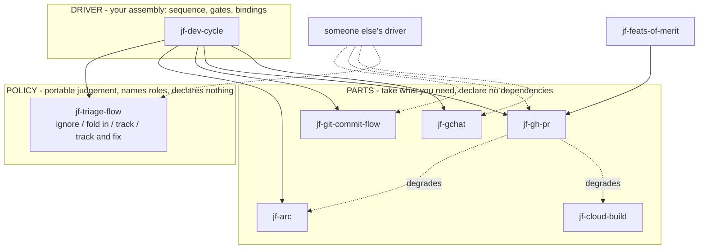

# Claude Skill Plugin Packaging - Plan

## Goal Capsule

**Objective.** Repackage the personal skills in `claude/skills/` as eight `jf-` prefixed Claude Code plugins published from one personal marketplace — parts and providers that do one thing and declare nothing, one policy plugin carrying portable judgement, and one driver assembling them into a development cycle — so someone can take the parts without inheriting the assembly, and a generic subset can be published later.

**Product authority.** This plan owns the packaging structure: how many marketplaces, which plugin owns each skill, what kind each plugin is, how they depend on each other, how org-specific configuration separates from portable skill logic, and the four stages the work is delivered in. It owns skill content only where packaging forces it: script paths, cross-skill references, and hard-coded identifiers.

**Open blockers.** None. Membership is settled at eight plugins over 19 packaged skills, with five staying local, names take the `jf-` prefix and are reversible through a `renames` map, and the marketplace is `benjfactor` served from `benjfactor/dotfiles`. Remaining questions are deferred to planning rather than blocking it.

## Product Contract

### Summary

Publish the personal skills as eight plugins from a single marketplace, sorted by what each is for rather than by topic: parts and providers do one thing and declare nothing, one policy plugin carries portable judgement, and one driver assembles the rest into a development cycle. Others take the parts and get value in isolation; only the driver requires the assembly. Delivered in four stages — regroup the skills, package them, decompose the policy, then build the driver — so the structure is proven before anything is published and the hardest work happens last. Org identifiers move behind `userConfig` so the parts become publishable without a restructure.

### Problem Frame

The skills currently live in `claude/skills/` and reach Claude Code through a symlink at `~/.claude/skills`. That gives version control and a fast edit loop but distributes nothing: a teammate cannot install a skill, there is no version to pin, and there is no update path. Moving to a new machine made the seams visible.

The skills are densely interlinked — 13 of 23 reference at least one other by name, and `regression-triage` reaches eleven — so any split has to survive that graph rather than cut across it. They are also unevenly opinionated. `send-gchat-message` is a reusable primitive that posts to a Chat space; `notify-pr-channels` is a personal convention about which channels a passing build should reach. Packaging them together forces anyone who wants the primitive to adopt the convention.

### Key Decisions

- **One marketplace, many plugins.** (session-settled: user-approved — chosen over several marketplaces: marketplaces split on trust and ownership, there is one owner, and adding a marketplace is the only friction a consumer ever pays.) Governs R1.
- **Layered plugins using `dependencies`.** (session-settled: user-directed — chosen over a single all-in plugin and over a dependency-free split: the base-and-extension shape is the goal, and the mechanism exists.) Governs R2, R6.
- **Level is the primary split; surface is secondary.** (session-settled: user-directed — chosen over slicing by integration surface alone: surface grouping put opinionated conventions next to the primitives they wrap, and a consumer who wants a primitive should not inherit the convention above it.) Governs R3, R4, R5.
- **Token cost is not a splitting criterion.** Measured always-on cost across all 23 skills is ~1,840 tokens, roughly twice the ecosystem median for one plugin and below its 90th percentile. The split buys selective adoption and publishability, not weight.
- **Optional surfaces stay optional in prose, not in manifests.** Claude Code has no peer or optional dependency, so a hard `dependencies` entry would over-require a consumer whose CI or browser differs. Governs R7.
- **Descriptive plugin names over evocative ones.** Plugin names are the human-facing install decision; the model matches on skill names and descriptions. Governs R8, R15.
- **Names are reversible, so naming does not block.** The marketplace `renames` map migrates an old name to a current one, supports multi-hop chains, and tombstones removals with `null`; the validator rejects dangling targets and cycles. Governs R14, R17.
- **Capability grouping follows the consumer's need, not the vendor's catalog.** A `gcloud` plugin bundling BigQuery and logging would group by billing relationship rather than by anything a consumer wants together. Governs R16.
- **Level is depth, not portability.** Fusing the two pushed org-specific level-2 workflows up to the org level and produced dependencies pointing upward: the PR flow calls `notify-pr-channels`, so that skill sits below it regardless of being Vendasta-specific. Governs R18.
- **Parts, policy, and glue.** The goal is that someone takes the parts they want and writes their own glue, so only glue carries dependencies. Composability is mostly a skill-writing property rather than a packaging one: a skill that names another skill pins an implementation, while one that names an outcome lets any plugin satisfy it. Governs R22, R23.
- **The judgement is the portable asset, not the primitives.** Posting to Chat or opening a browser is trivially reimplemented; the triage decision — ignore, fold into the current work item, or track separately with or without fixing it — is the part worth reusing, and it is reused over someone else's dev flow rather than replaced by their own. It therefore names roles and ends with the fewest dependencies, inverting its current position as the most entangled plugin. Governs R22a.
- **Four stages, with the hardest work last.** Regrouping proves the structure while everything is still local and reversible; packaging is mechanical once the grouping holds; decomposing the policy changes what a skill says, so it runs against a structure that has stopped moving; and the driver is built last because it is the only stage delivering new capability rather than repackaging. Governs R27, R28, R29, R30a.
- **`plan-commit-to-worktree` is retired, not packaged.** The harness now creates a worktree at session start, which was the skill's distinguishing job; what remains is already covered by `jf-gh-pr` and `jf-arc`.
- **CI is a provider, and the code already says so.** `merge-pr` queries GitHub's status rollup first and escalates to Cloud Build only when a check is still pending, which is a substitutable-provider relationship with a working fallback already in place. Governs R26.
- **Packaging breaks bundled-script paths, independent of grouping.** Skills invoke scripts through `~/.claude/skills/<name>/` in both its `~` and `$HOME` spellings, a path that exists only because the skills are symlinked; an installed plugin lives under a versioned cache path. Two of those calls reach into a *different* plugin's script tree, which no path rewrite can fix — the consumer delegates to the owning skill instead. Governs R25, R25a.
- **Stay below 1.0, and leave dependencies unpinned while there.** A 0.x line makes a breaking change a minor bump instead of a promise the shape cannot yet keep. Pinning under 0.x would be self-defeating: semver's caret excludes minor bumps below 1.0, so `^0.1.0` rejects 0.2.0 and every part release would force a matching bump in each plugin pinning it. Governs R31, R32.
- **The marketplace ships from the existing public dotfiles repo.** That keeps the symlink edit loop and adds no new repository, at the cost of per-plugin release tags landing in it and stage 2 being a public release rather than a private one. Governs R33, R34.
- **Membership is the one decision that hardens at first publish.** Names stay reversible through `renames`; skill moves do not, which is why membership is settled before anything ships rather than after. Governs R19.

Parts, policy and driver, per R22. Parts sit alongside one another and declare nothing; only the driver points at them, and a dashed edge is a capability the part degrades without rather than a dependency it declares:

Levels still record composition depth per R18 — capability, workflow, orchestration — and the diagram's arrows are exactly the downward edges that rule permits. Parts and glue is the sharper cut, so it is the one drawn.

The target end state is one driver over parts anyone can use in isolation. The cycle it drives:

### Requirements

**Distribution shape**

- R1. All personal plugins publish from a single marketplace; a second marketplace is added only when a genuinely different trust or ownership boundary appears, such as a public subset under a separate owner.
- R2. Plugins layer through `plugin.json` `dependencies`, so a lower-level plugin installs without pulling in the levels above it.

**Level structure**

- R3. Each plugin sits at exactly one level: capability, workflow, or org orchestration.
- R4. A capability plugin wraps one external tool, carries no workflow opinion, and declares no dependency on another personal plugin.
- R5. A workflow plugin holds personal conventions and depends on the capability plugins whose tools it uses, so a consumer can adopt the capability without the convention built on it.
- R6. Dependency edges point from higher levels to lower levels only; no capability plugin depends on a workflow plugin.
- R7. Where a workflow plugin's use of a capability is optional, it does not declare a hard dependency on that capability's plugin. This covers Cloud Build status for `merge-pr` and `pr-feedback-watcher`.
- R8. Each plugin name describes what it owns, and no name collides with a name in a marketplace already added on this machine. An unprefixed `github` is excluded on that basis.

**Portability**

- R9. The `jf-git-commit-flow` plugin assumes git only and invokes no GitHub tooling, so it is usable on a non-GitHub remote. Skills that shell out to `gh` sit in `jf-gh-pr` instead, including `sync-base` and `worktree-cleanup`.
- R10. Org-specific identifiers move behind `userConfig` rather than remaining literal in skill bodies or bundled scripts. This covers the Chat space ID `AAAAIj8WMWc`, the `@vendasta/meerkats` handle, and the `TEAM_CHANNELS` map.
- R11. Each plugin records which of its skills require org-internal configuration, so a plugin can be published without shipping internal defaults.

**Development workflow**

- R12. Skills stay editable in place during development, with no reinstall step between an edit and the next session using it.
- R13. Marketplace and plugin manifests pass `claude plugin validate --strict` before release.

**Naming and grouping**

- R14. Plugin names are treated as reversible. When a name changes, the marketplace declares the old name in its `renames` map pointing at the current one; a removed plugin is tombstoned with `null` rather than dropped silently.
- R15. Every plugin carries a marketplace-entry `description` stating what a consumer gets and what they must already have installed or authenticated, plus a `displayName` whenever the machine name is not the clearest human label.
- R16. Capability plugins group by the capability a consumer wants, not by the vendor that supplies it. A single vendor's unrelated tools stay in separate plugins.
- R17. Plugin names carry no `-skills` or `-plugin` suffix.
- R17a. Plugin names carry the prefix `jf-`, so a plugin is `jf-gh-pr` rather than `gh-pr`. Skills are not prefixed: invocation is already `plugin:skill`, so `jf-gh-pr:open-pr` needs nothing further. No official marketplace name collides — `jfrog` is the only one sharing the letters.

**Level semantics**

- R18. Level records composition depth only — what builds on what. Publishability is a separate per-plugin property, so an org-specific plugin sits at whatever depth its dependencies put it at rather than being pushed to the org level.
- R19. Skill-to-plugin membership is settled before the first publish. A plugin rename is migratable through `renames`, but a skill moving between plugins has no migration path and silently removes the skill from anyone who installed the old plugin.

**Packaging scope**

- R20. Packaging every skill is not a goal. A skill with no distribution need stays unpackaged as a local skill symlinked from `claude/skills/`, and that is a settled outcome rather than an unfilled gap.
- R21. A skill stays unpackaged only when no packaged skill delegates to it, since a plugin that ships a delegation to a local skill hands consumers a reference they cannot resolve.

**Composability**

- R22. Plugins divide into parts, policy, and glue. A part declares no dependency on another personal plugin and degrades when an adjacent capability is absent. A policy plugin carries portable judgement, names the roles it needs rather than the plugins that fill them, and declares no dependency either. Only glue — the wiring of specific parts into those roles — declares dependencies.
- R22a. A policy plugin's dependency count is the measure of whether it is portable. `jf-triage-flow` carries the reusable judgement, so it ends with the fewest dependencies rather than the most.
- R22b. Exactly one plugin is the driver. It owns the development cycle's sequence, its human gates, and the bindings from roles to specific parts, and it is the one plugin where hard dependencies — including cross-marketplace ones — are correct, because installing it means opting into that assembly.
- R22c. The driver closes a loop rather than ending a chain: triage of what deploy surfaces feeds new work back to the start of the cycle. A design that terminates after deploy has lost the property the cycle exists for.
- R22d. The driver's value is its gates and waits, not its steps. Steps already exist as skills; what exists nowhere is the sequencing, the human review points, and the event transitions between them.
- R22e. Needing a command-line tool is not a dependency on the plugin that happens to wrap it. `wsu` calls `gh search prs` directly and depends on no personal plugin; only a delegation to another plugin's *skill* is a dependency. Conflating the two manufactures edges that do not exist — it is what wrongly gave `jf-feats-of-merit` an edge to `jf-gh-pr`.
- R23. A skill references outcomes, not other skills by name. `merge-pr` requires that CI is confirmed green rather than that `gcp-ci-watch` is invoked, so any plugin satisfying the outcome composes. Eighteen existing cross-plugin delegations are rewritten to this form, enumerated in the Appendix, plus three reverse mentions that dangle the same way.
- R24. No skill references another skill by relative file path. `notify-pr-channels` and `pr-studio-open-in-arc` currently do, and those paths cannot resolve once the skills sit in different plugins.
- R25. A bundled script is invoked through `${CLAUDE_PLUGIN_ROOT}` with a fallback for when the variable is unresolved, never through `~/.claude/skills/<name>/`. Skills currently hardcode the symlink path in both its `~` and `$HOME` spellings, and that path does not exist for an installed plugin.
- R25a. No skill or bundled script reaches into another plugin's files. A script stays in the plugin that owns it; a consuming plugin declares a dependency on the owning plugin and delegates to its skill. This keeps `${CLAUDE_PLUGIN_ROOT}` correct by construction — it resolves to the declaring plugin, so a script is only ever addressed by the plugin that ships it — and it is why runtime path-searching for a sibling plugin's script is not the answer. Where a dependency would make a plugin impure, the coupled job is split out and raised into the plugin that composes both, per R36.
- R26. `jf-gh-pr` names no CI provider. The check context is a `userConfig` value defaulting to all checks, so the plugin works on any CI, and `jf-cloud-build` is a precision upgrade rather than a requirement. `merge-pr` and `pr-feedback-watcher` currently hardcode `.context == "ci/cloudbuild"` in their status queries, which is the only thing making the GitHub part CI-provider-specific.

**Delivery stages**

- R27. Stage 1 regroups the existing skills into plugin-shaped directories without publishing anything. It is complete when each skill sits under the plugin that owns it, every coupling that has become internal to a plugin is left alone, every coupling that still crosses a plugin boundary satisfies R23 and R24, and the directories load from `~/.claude/skills/` as `<name>@skills-dir` so the symlink edit loop survives.
- R28. Stage 2 turns those directories into marketplace plugins. It is complete when a `marketplace.json` lists them except `jf-triage-flow`, which is withheld per R30, each carries a `plugin.json` with a description and any `userConfig` required by R10 and R15, every bundled script resolves through `${CLAUDE_PLUGIN_ROOT}` per R25, and `claude plugin validate --strict` passes per R13.
- R29. Stage 3 decomposes `jf-triage-flow` from one opinionated skill into policy. It is complete when the judgement is expressed over the four roles it needs — inspect recent work, record a finding, fix it, tell someone — and the plugin declares zero dependencies per R22a.
- R30. `jf-triage-flow` is withheld from the stage 2 publish. Stage 3 may split or move its skills, and R19 leaves a skill move no migration path once installed, so it publishes in stage 3 once its shape is settled.
- R30a. Stage 4 builds the driver. `jf-dev-cycle` gains the sequencing, human gates, event transitions and cross-session resume logic that R22b through R22d describe. It is complete when the cycle runs from tracking item through deploy watch to triage and back to the start across more than one session. Stages 1 through 3 deliver packaging and decomposition only; none of them authors the sequencing R22d identifies as the thing that exists nowhere today, so without this stage the driver would publish as three ordinary skills and no cycle.

**Release and versioning**

- R31. Plugins release at `0.minor.patch` and stay below 1.0 until the shape has stopped moving, so a breaking change costs a minor bump rather than a major-version promise nothing yet justifies.
- R32. While below 1.0, a dependency string names a plugin and marketplace without a version range. Version resolution is standard semver, where `^0.1.0` means `>=0.1.0 <0.2.0`, so a caret range under 0.x breaks on every minor bump of the dependency and would force a matching bump in each plugin pinning it. Ranges are introduced at 1.0, where caret behaviour stops being a trap.
- R33. The marketplace is named `benjfactor` and is served from the existing `benjfactor/dotfiles` repository, giving ids of the form `jf-gh-pr@benjfactor`. Releases are tagged with `claude plugin tag`, which produces one `{name}--v{version}` tag per plugin release in that repository.
- R34. Because `benjfactor/dotfiles` is a public repository, stage 2 is a public release. R10 is therefore a stage 2 gate: no plugin ships a hard-coded Chat space id, team handle, or channel map, since a plugin that posts to a specific team by default is a different thing from a dotfile that mentions one.
- R35. `userConfig` values are stored under `pluginConfigs` in `~/.claude/settings.json`, keyed by `plugin@marketplace` with an `options` object, so they are already versioned in dotfiles through the existing settings symlink and no separate mechanism is needed. Options declared sensitive go to secure storage instead and are not versioned, so an option is marked sensitive only when it is genuinely a secret; a Chat space id is an identifier, not a credential.

**Skill decomposition**

- R36. A skill is split when it performs several jobs and one of them creates a coupling that would otherwise be carried into its plugin. The split serves boundary purity, not tidiness — a skill doing several tightly related things stays whole.
- R37. `jf-gh-pr` ships free of Jira, Chat, Confluence, Arc, and any named CI provider or repository. Reaching that requires the `ci/cloudbuild` check context to become config per R26, the `--repo vendasta/galaxy` literal to leave `merge-pr`, and `open-pr` to shed both its Jira link derivation and its Arc step. Those two move to `jf-dev-cycle`, which adds them around a pure PR open.

### Key Flows

- **Adopting one capability without the workflow above it.** Trigger: a teammate wants to post to a Chat space from Claude Code but does not want personal PR conventions. Steps: they add the marketplace, install `jf-gchat`, and configure their own space ID via `userConfig`. Outcome: no glue plugin is installed, and `notify-pr-channels` never enters their context. Covers R4, R5, R10.
- **Adopting the whole cycle.** Trigger: a teammate wants the full development loop, gates included. Steps: they add the compound-engineering and Vendasta marketplaces first per R2, then install `jf-dev-cycle`, which auto-installs every part and provider it binds. Outcome: the cycle runs end to end and closes back on itself through triage. Covers R2, R22b, R22c.
- **Reusing the judgement over a different dev flow.** Trigger: someone wants the triage decision — ignore, fold in, track, or track and fix — but runs their own pipeline on a different tracker and CI. Steps: they install `jf-triage-flow` alone, which pulls in nothing, and fill its roles from their own driver. Outcome: the judgement travels without the wiring. Covers R22a, R23.
- **Taking parts without the assembly.** Trigger: someone wants the commit and PR mechanics and nothing else. Steps: they install `jf-git-commit-flow` and `jf-gh-pr`, which pull in nothing, and pair them with their own CI provider. Outcome: no personal convention is inherited, and the PR part degrades gracefully without a CI provider present. Covers R22, R26.

### Scope Boundaries

- Skill bodies are rewritten only where packaging forces it: script paths per R25, cross-skill references per R23 and R24, hard-coded identifiers per R10, and the decomposition of a skill whose several jobs create a coupling a split would remove per R36. What a skill is *for* does not change.
- Stage 2 is a public release, because the marketplace is served from a public repository per R34. What is deliberately not published in stage 2 is `jf-triage-flow`, held back per R30.
- Whether `temporal-activities` and `pr-studio-open-in-arc` should instead go upstream into the Vendasta marketplace is not decided here. Both overlap plugins that already exist there.
- Release automation beyond R13's validate step is out of scope.
- Which plugins go public when the marketplace lands is decided at stage 2 and written into that stage's plan, not assumed. The repository is public, so publishing the marketplace exposes whatever it lists; `jf-triage-flow` is already withheld, and any plugin still carrying an org identifier is withheld with it until that identifier moves behind configuration.
- Stages 1 through 3 deliver packaging and decomposition, not new capability. The development cycle itself — the gates, waits and transitions that make `jf-dev-cycle` a driver rather than three skills — arrives in stage 4 per R30a. A reader should not expect the cycle to work at the end of stage 3.

### Dependencies / Assumptions

- Claude Code 2.1.251 accepts `dependencies` in `plugin.json` as an array of strings, auto-installs them, and prunes orphans via `claude plugin prune`. Verified by schema probe against the installed binary.
- `peerDependencies` is not supported; the validator reports it as an unknown field ignored at load time. This is why R7 exists.
- `renames` in `marketplace.json` maps an old plugin name to a target that must be a name in `plugins[]`, another `renames` key, or `null`. Multi-hop chains and `null` tombstones validate clean; dangling targets fail as `target-missing` and cycles as `cycle`. Verified by schema probe. The official marketplace carries nine live rename entries, most stripping a `-skills` or `-plugin` suffix.
- Verified for renames: schema and validation behavior only. Install-time migration — whether a rename rewrites `enabledPlugins` keys in an existing `settings.json` or migrates an already-installed copy — was not verified and needs a real publish to test. The skill invocation prefix does change with the plugin name.
- `description`, `displayName`, `keywords`, `author`, and `version` are accepted in `plugin.json`; `category` is not and warns as belonging in the marketplace entry. All 291 official marketplace entries set `description`.
- A dependency's marketplace must already be added before install; Claude Code will not add one on the user's behalf.
- `jf-dev-cycle` is the only plugin carrying cross-marketplace dependencies: `compound-engineering` for the brainstorm and plan steps, `vendasta-dev-agent-toolkit` for deploy watching. Installing it therefore requires both marketplaces to be added first, which is the honest reason the driver is personal while the parts are not.
- Assumed but unverified: a bare dependency name without `@marketplace` resolves within the declaring plugin's own marketplace. The schema accepts the bare form; resolution was not confirmed.
- `claude plugin init <name>` scaffolds into `~/.claude/skills/<name>/` and auto-loads as `<name>@skills-dir`, which is the candidate mechanism for R12.
- `benjfactor/dotfiles` is a public repository, and the Chat space ID in R10 is already committed there in six files. R10 is cleanup of a current state, not a precondition for a future one.

### Outstanding Questions

**Resolve Before Planning**

None. Membership, naming, marketplace, repo home, and staging are all settled.

**Deferred to Planning**

- Which of the cross-plugin skill references can be rewritten as outcomes per R23 without losing precision, and which genuinely need to name an implementation. Answered per reference during stage 1.
- The `userConfig` schema shape for R10, which stage 2 needs and stage 1 does not.
- Whether a bare dependency name resolves within the declaring plugin's own marketplace. R32 sidesteps this by naming the marketplace explicitly, so it matters only if the shorter form is preferred later.

### Sources / Research

- `claude/skills/README.md` — the existing skill-flow mermaid diagram and the develop/ship/deploy chain it documents.
- Surface matrix, cross-reference graph, and proposed level assignment for all 23 skills: see Appendix.
- `~/.claude/plugins/marketplaces/vendasta-dev-agent-toolkit/.claude-plugin/marketplace.json` — in-house precedent: one marketplace, eleven plugins from subdirectories, `defaultEnabled: false` on six, including a personally-named plugin.
- `~/.claude/plugins/marketplaces/claude-plugins-official/.claude-plugin/marketplace.json` — 290 entries; none declare `dependencies` and none use `defaultEnabled`.
- Ecosystem packaging statistics from the local plugin catalog cache: median 3 skills per plugin, mean 7.6; always-on cost median 832 tokens, p90 4,249.

---

## Planning Contract

**Product Contract preservation:** unchanged. No R-ID was split, renumbered, or rescoped during enrichment.

**Scope of this plan:** stage 1, which is broader than the stage 1 completion gate alone. It also pulls forward the bundled-script path fixes that the stage 2 gate lists, the provider-neutrality work on the GitHub plugin, and the retirement of `plan-commit-to-worktree`. Stage 2 therefore inherits the script-path clause already satisfied. Stages 2 through 4 stay named phases and get units when stage 1 has landed.

**One requirement has no home yet.** The rule that each plugin records which of its skills need org-internal configuration is named by no stage gate — the stage 2 gate covers moving identifiers behind `userConfig` and writing descriptions, but not that separate record. Settle at stage 2 planning whether the `userConfig` declarations already serve as the record or whether it needs its own artifact.

### Key Technical Decisions

- KTD1. **Plan stage 1 alone; later stages get units when they are reached.** (session-settled: user-directed — chosen over planning every stage as phases up front: the restructure will teach things that would invalidate speculative units for the stages after it.) Governs R27.
- KTD2. **Restructure in place under `claude/skills/`, not into a parallel tree.** Each plugin becomes `claude/skills/<jf-name>/` holding `.claude-plugin/plugin.json` and `skills/<skill>/SKILL.md`. The existing `~/.claude/skills` symlink is untouched, every plugin auto-loads as `<name>@skills-dir`, and stage 2's marketplace entry can point `source: "./claude/skills/<jf-name>"` — one location serving both the dev loop and publication. Governs R27, and satisfies R12 without new machinery.
- KTD3. **Prove the mixed layout before moving anything.** Stage 1 requires `~/.claude/skills/` to hold plugin directories and plain skill directories side by side, since five skills stay unpackaged. `claude plugin init` scaffolds plugins into exactly that directory, so mixing is strongly implied but unverified. U1 is a spike; if it fails, KTD2 is void and the restructure needs a different home. Governs R20.
- KTD4. **`jf-gh-pr` purity lands in stage 1, not stage 2.** Removing the CI context, the named repo, and the Jira and Arc steps is skill-body work, and stage 2 is packaging. Doing it here also means stage 2 packages something already clean. Governs R37.
- KTD5. **Outcome rewrites are decided per reference, with the user.** R23 converts skill-name references to outcomes, but which references genuinely lose precision is a judgement call — a wholesale substitution risks quietly degrading a skill. The implementer proposes per reference and asks. Governs R23.
- KTD6. **The vendasta marketplace is the layout pattern.** `.claude-plugin/marketplace.json` at repo root, each subdirectory plugin carrying its own `.claude-plugin/plugin.json` and `skills/<skill>/SKILL.md`, with skills free to hold `references/` and `scripts/` subdirectories. Verified on disk at `~/.claude/plugins/marketplaces/vendasta-dev-agent-toolkit`.

### Assumptions

- `~/.claude/skills/` distinguishes a plugin directory (contains `.claude-plugin/`) from a skill directory (contains `SKILL.md`) and loads both. U1 verifies this.
- Renaming a skill's *directory* does not change how the model matches it. Frontmatter `description` is a different matter: two cross-plugin references live in description text, so U5 does edit the field the model matches on, and each edited skill needs re-checking against its triggers.
- No packaged skill *delegates* to an unpackaged one, but `open-in-arc` *mentions* `pr-studio-open-in-arc`, which stays local — so the rule has to cover mentions, not just delegations, and that reference is in U5's scope. Verified against the enumerated cross-reference table rather than the earlier tier summary.

### Sequencing

U0 runs first so live checks can see the branch. U1 then gates everything else. U2 moves files and must complete before the reference and path fixes (U3–U5) can be verified in their final locations. U6 and U7 are independent of each other and can land in any order after U2.

## Implementation Units

### U0. Point the loader at the branch under test

- **Goal.** Make live-session verification possible for every later unit.
- **Requirements.** KTD2, and the Definition of Done's live-session criterion.
- **Dependencies.** None. Runs first.
- **Files.** No repository files — this changes the `~/.claude/skills` symlink only.
- **Approach.** `~/.claude/skills` points at the master checkout's `claude/skills`, while stage 1 happens in a worktree, so nothing edited on the branch reaches the loader. Repoint the symlink at the worktree's `claude/skills` for the duration of stage 1, recording the original target. Restore it at completion. Without this, every per-unit live check silently exercises master.
- **Test scenarios.**
  - After repointing, a skill edited in the worktree shows its edit in a new session.
  - After restoring, `readlink ~/.claude/skills` returns the original master path.
- **Verification.** The symlink resolves into the worktree during stage 1 and back to `~/dotfiles/claude/skills` at the end.

### U1. Prove plugin and skill directories coexist

- **Goal.** Establish that `~/.claude/skills/` loads a plugin directory and a plain skill directory side by side, before any file moves.
- **Requirements.** R20, KTD3.
- **Dependencies.** None.
- **Files.** No tracked files, but not scratch: `claude plugin init` writes into `~/.claude/skills/<name>/`, which is a symlink into the dotfiles working tree, so the scaffold appears as untracked repository content and must be removed before any commit.
- **Approach.** Scaffold one throwaway plugin into `~/.claude/skills/` with `claude plugin init`, leaving the existing plain skill directories in place. Start a new session and check that the scaffolded plugin's skill resolves under its plugin prefix while an existing unpackaged skill still resolves unprefixed. Remove the scaffold afterwards.
- **Test scenarios.**
  - A scaffolded plugin's skill is offered as `<plugin>:<skill>` in a new session.
  - An existing plain skill directory in the same folder still resolves by its bare name in that same session.
  - Removing the scaffold leaves the plain skills resolving as before.
  - The scaffold's generated `plugin.json` is read and its field set recorded before removal, so U2 knows what a loadable manifest requires.
  - `git status` shows no scaffold residue once it is removed.
- **Verification.** Both resolution styles observed in one session. If they cannot coexist, stop and report — KTD2 is void and the restructure needs a different home.

### U2. Restructure claude/skills into eight plugin directories

- **Goal.** Move the 18 packaged skills under the `jf-` plugin that owns each, leaving the five unpackaged skills as plain skill directories.
- **Requirements.** R3, R4, R5, R20, R27, KTD2.
- **Dependencies.** U1.
- **Files.** `claude/skills/` throughout — each packaged skill moves from `claude/skills/<skill>/` to `claude/skills/<jf-plugin>/skills/<skill>/`. Membership is the Appendix assignment table. `claude/skills/README.md` needs its layout description updated.
- **Approach.** Move with `git mv` so history follows. Create each plugin directory with a `skills/` subdirectory and a `.claude-plugin/plugin.json` carrying at least `name`, `version` (`0.1.0`, per R31) and `description` — `validate --strict` errors with "No manifest found" on a bare directory and exits 1 with "No version specified" on a manifest without one, so the stage 1 gate cannot pass otherwise. Everything else in the manifest, including `userConfig` and marketplace metadata, is stage 2's job. Leave `vim-rest`, `user-preferences`, `temporal-activities`, `pr-studio-open-in-arc` and `plan-commit-to-worktree` where they are. Do not edit any skill body in this unit — moves only, so a failure here is trivially distinguishable from a content bug.
- **Test scenarios.**
  - Each of the 18 skills resolves under its plugin prefix in a new session.
  - Each of the 5 unpackaged skills still resolves by bare name.
  - `git log --follow` on a moved SKILL.md still reaches its pre-move history.
- **Verification.** All 23 skills load; nothing is orphaned; no skill body changed in this commit.

### U3. Replace symlink script paths with CLAUDE_PLUGIN_ROOT

- **Goal.** Bundled scripts resolve from the plugin that ships them rather than from `~/.claude/skills/<name>/`, which will not exist for an installed plugin.
- **Requirements.** R25.
- **Dependencies.** U2.
- **Files.** `claude/skills/jf-gchat/skills/send-gchat-message/SKILL.md`, `claude/skills/jf-dev-cycle/skills/notify-pr-channels/SKILL.md`, `claude/skills/jf-dev-cycle/skills/notify-pr-channels/scripts/chat_post.py`, `claude/skills/jf-dev-cycle/skills/pr-ready/SKILL.md`, `claude/skills/jf-gh-pr/skills/pr-feedback-watcher/SKILL.md`, `claude/skills/jf-triage-flow/skills/regression-triage/SKILL.md`, and `open-in-arc`'s SKILL.md under `jf-arc`. Also the three packaged skills that name the path in prose rather than invoking it — `green-commits`, `plan-implementation-commits` under `jf-git-commit-flow`, and `git-worktree-jira-branch` under `jf-dev-cycle` — whose self-references must be stripped for the gate to hold.
- **Approach.** Two rules. **Within a plugin**, an invocation becomes `${CLAUDE_PLUGIN_ROOT:-$HOME/.claude/skills/<jf-plugin>}/skills/<skill>/<script>`, using post-move paths — `open-in-arc`'s current fallback targets its pre-move location and needs repointing rather than copying. **Across plugins**, no script is resolved at all: a script stays in the plugin that owns it, the consuming plugin declares a dependency on the owning plugin, and the consuming skill delegates to the owning *skill* rather than reaching for its file. `${CLAUDE_PLUGIN_ROOT}` then always resolves correctly, because every script is invoked only by its own plugin.
- **Approach note — the two cross-plugin cases dissolve rather than being resolved.** `notify-pr-channels` currently imports `send_gchat` for `PEOPLE`, `get_access_token`, `resolve_target` and `post_message`; everything else in `chat_post.py` is the PR message shape and target selection. It becomes prose that builds the message and targets and then invokes `jf-gchat:send-gchat-message` through the interface that skill already documents, and `chat_post.py` is deleted. `regression-triage` likewise delegates instead of shelling `send_gchat.py`. `jf-dev-cycle` and `jf-triage-flow` each declare a dependency on `jf-gchat`.
- **Test scenarios.**
  - Each affected script executes when invoked through the skill in a new session.
  - With `CLAUDE_PLUGIN_ROOT` unset, the fallback path still resolves for a skills-dir plugin.
- **Verification.** `grep -rnE '(~|\$HOME)/\.claude/skills/' claude/skills | grep -v 'CLAUDE_PLUGIN_ROOT:-'` returns hits only inside the five unpackaged skills. Both spellings must be covered — three invocations use the `$HOME` form and would pass a tilde-only pattern — and the exclusion is required because the prescribed fallback contains the path by design.

### U4. Remove relative-path cross-references

- **Goal.** No skill points at another skill by relative file path, since those paths cannot resolve once the skills sit in different plugins.
- **Requirements.** R24.
- **Dependencies.** U2.
- **Files.** `claude/skills/jf-dev-cycle/skills/notify-pr-channels/SKILL.md` (two references), and `pr-studio-open-in-arc`'s SKILL.md, which stays unpackaged but still carries a now-broken path.
- **Approach.** Replace each `../<skill>/SKILL.md` link with a plain reference to the capability. `notify-pr-channels` points twice at `send-gchat-message`, which now lives in a different plugin, so those two are the load-bearing fixes.
- **Test scenarios.**
  - No file under `claude/skills/` matches `\.\./[a-z-]*/SKILL\.md`.
  - `notify-pr-channels` still conveys that Chat delivery and channel resolution are delegated, without naming a path.
- **Verification.** The grep returns nothing, and each edited skill still reads coherently on its own.

### U5. Rewrite cross-plugin references as outcomes

- **Goal.** A skill in one plugin names the outcome it needs rather than the skill that provides it, so any plugin satisfying the outcome composes.
- **Requirements.** R23, KTD5.
- **Dependencies.** U2.
- **Files.** The eighteen delegations enumerated in the Appendix cross-reference table, plus the three reverse mentions named beneath it. Eleven sit in `regression-triage` alone. References internal to a single plugin are left alone.
- **Approach.** For each reference that crosses a plugin boundary, propose the outcome phrasing and ask before applying it — for example `merge-pr` requiring that CI is confirmed green rather than that `gcp-ci-watch` is invoked. Where naming the implementation is genuinely load-bearing, keep it and record why. `jf-triage-flow` is the densest case and is also stage 3's subject, so restrict this unit to making its cross-plugin references resolvable; the decomposition is out of scope.
- **Execution note.** This is the judgement-heavy unit. Propose per reference and wait; do not batch-substitute.
- **Test scenarios.**
  - Each rewritten reference still tells the model what to achieve, with no dangling skill name.
  - A skill whose named dependency is absent degrades in prose rather than dead-ending.
- **Verification.** Every cross-plugin reference either names an outcome or carries a recorded reason for naming an implementation.

### U6. Make jf-gh-pr provider-neutral

- **Goal.** `jf-gh-pr` ships free of Jira, Chat, Confluence, Arc, and any named CI provider or repository.
- **Requirements.** R9, R26, R36, R37.
- **Dependencies.** U2.
- **Files.** `claude/skills/jf-gh-pr/skills/merge-pr/SKILL.md`, `claude/skills/jf-gh-pr/skills/pr-feedback-watcher/SKILL.md`, `claude/skills/jf-gh-pr/skills/pr-feedback-watcher/scripts/review_gate.py`, `claude/skills/jf-gh-pr/skills/open-pr/SKILL.md`, and `claude/skills/jf-dev-cycle/skills/` for the steps that move.
- **Approach.** Four removals. The `ci/cloudbuild` check context in `merge-pr` and `pr-feedback-watcher` becomes a configurable value defaulting to all checks. The `--repo vendasta/galaxy` literal leaves `merge-pr`. `open-pr` sheds its Jira link derivation and its Arc step. Both move into a new `jf-dev-cycle` skill, `open-tracked-pr`, which delegates the PR open to `jf-gh-pr:open-pr` and then prepends the ticket link and shows the result in the browser — a split under R36, since each is a distinct job creating a coupling. This raises the packaged count to 19 and the total to 24. Stage 4's driver later calls `open-tracked-pr` as one step of the cycle; stage 1 only has to make it independently invocable. Declaring the check context in `plugin.json` `userConfig` is stage 2; stage 1 need only stop hardcoding it.
- **Test scenarios.**
  - `merge-pr` reports CI status on a repo whose checks are not named `ci/cloudbuild`.
  - `merge-pr` targets the current repo rather than a named one.
  - `open-pr` creates a draft PR with the repo template and no Jira line on a repo with no ticket convention.
  - Invoking `jf-dev-cycle:open-tracked-pr` directly produces a draft PR carrying the ticket link and opens it in the browser, with no driver present.
- **Verification.** No file under `claude/skills/jf-gh-pr/` matches `jira|vendasta|cloudbuild|arc|gchat|confluence`, case-insensitive.

### U7. Retire plan-commit-to-worktree

- **Goal.** Stop invoking a skill whose distinguishing job the harness now performs.
- **Requirements.** R20, and the Key Decision retiring it.
- **Dependencies.** U2.
- **Files.** `claude/CLAUDE.md` — remove the rule invoking the skill after every `ce:plan`. `claude/skills/plan-commit-to-worktree/` stays on disk as an unpackaged skill.
- **Approach.** Remove the standing instruction. Leave the skill directory in place so it remains available if invoked deliberately; retirement here means nothing fires it automatically, not deletion.
- **Test scenarios.**
  - A `ce:plan` run no longer triggers the skill.
  - No remaining skill or instruction references it.
- **Verification.** `grep -rn 'plan-commit-to-worktree' claude/` matches only the skill's own directory.

---

## Verification Contract

- `claude plugin validate --strict <dir>` passes for every plugin directory created in U2. Stage 1 produces skills-dir plugins, so this is the gate that catches manifest and skill-frontmatter errors before stage 2 depends on them.
- All 24 skills load in a fresh session: 19 under `jf-<plugin>:<skill>`, 5 by bare name. The 24th is `open-tracked-pr`, created by U6.
- `grep -rn '\.\./[a-z-]*/SKILL\.md' claude/skills` returns nothing.
- `grep -rni 'jira\|vendasta\|cloudbuild\|arc\|gchat\|confluence' claude/skills/jf-gh-pr` returns nothing.
- `grep -rnE '(~|\$HOME)/\.claude/skills/' claude/skills | grep -v 'CLAUDE_PLUGIN_ROOT:-'` returns hits only within the five unpackaged skills.
- Each bundled script still executes when invoked through its skill.
- No stage 2 or 3 artifact appears: no `marketplace.json`, no publish, no `jf-triage-flow` decomposition.

## Definition of Done

**Global**

- U0 through U7 are complete, or U1 failed and the run stopped with KTD2 reported void.
- Every Verification Contract check passes.
- The restructure is committed in small increments per the `green-commits` skill, with the U2 move committed separately from any content change so a regression is attributable.
- `claude/skills/README.md` describes the new layout, and its skill-flow diagram reflects the plugin grouping.
- `claude/CLAUDE.md`'s standing instructions no longer name skills by their bare names. Three of them do today, and those names change to the plugin-prefixed form when the skills move.
- No scratch or experimental directory from U1 remains anywhere, including `~/.claude/skills/`.
- The `~/.claude/skills` symlink is restored to its original master-checkout target per U0. Leaving it pointed at a worktree that may later be deleted would break every skill.
- Stage 1's completion gate in R27 is satisfied in full.

**Per unit**

Each unit is done when its own Verification line holds and its test scenarios have been exercised in a live session — not merely reasoned about. Skills are prose the model reads; the only real proof that one still works is loading it.

## Appendix

### Proposed level assignment

Plugin names below are settled per the Goal Capsule and remain reversible per R14. This revision resolves the three upward dependencies produced by treating org-specificity as a level, per R18.

| Plugin | Kind | Level | Skills | ~always-on tokens | Depends on |
|---|---|---|---|---|---|
| jf-gchat | part — provider (comms) | capability | send-gchat-message | 96 | — |
| jf-arc | part — provider (browser) | capability | open-in-arc | 87 | — |
| jf-cloud-build | part — provider (CI) | capability | gcp-ci-watch | 63 | — |
| jf-git-commit-flow | part | workflow | green-commits, commit-preferences, plan-implementation-commits, golang-pre-commit-tests | 340 | — |
| jf-gh-pr | part | workflow | open-pr, merge-pr, pr-feedback-watcher, sync-base, worktree-cleanup | 407 | — (degrades without jf-cloud-build) |
| jf-triage-flow | policy | orchestration | regression-triage | 147 | — (names roles, per R22a) |
| jf-dev-cycle | driver | orchestration | git-worktree-jira-branch, pr-ready, notify-pr-channels, open-tracked-pr (new, U6) | ~230 | jf-git-commit-flow, jf-gh-pr, jf-gchat, jf-arc, jf-triage-flow, compound-engineering, vendasta-dev-agent-toolkit |
| jf-feats-of-merit | part | workflow | wsu, wsu-note | 118 | — |

Eight plugins covering 19 skills once U6 creates `open-tracked-pr`; 18 before it. Parts and providers are usable in isolation and declare nothing; `jf-dev-cycle` is the assembly and carries every dependency, including the two cross-marketplace ones. Verified against the delegation graph: zero upward dependencies and zero unresolvable references.

`jf-triage-flow`'s five dependencies in that graph are today's prose, not the target. Stage 3 takes them to zero per R22a; until then the count is the measure of how far the judgement is from travelling.

**Unpackaged, per R20.** `vim-rest`, `user-preferences`, and `temporal-activities` stay symlinked local skills, and R21 holds for each because none is the target of a delegation from a packaged skill. `pr-studio-open-in-arc` is also unpackaged; it belongs upstream in `vendasta-pr-studio`, and `temporal-activities` similarly duplicates `vendasta-dev-agent-toolkit:temporal-workflows`.

**`plan-commit-to-worktree` is retired rather than packaged.** Its distinguishing job was creating a worktree and moving the plan into it, and the harness now creates a worktree at session start — `ce-worktree` states this directly. What remains is commit, open draft PR, open in Arc, all covered by `jf-gh-pr` and `jf-arc`. The CLAUDE.md rule invoking it after `ce:plan` retires with it.

**Execution risk on the driver.** A skill is a prompt-time instruction and does not durably wait, while the cycle spans days and many sessions. The driver is therefore a set of entry points plus resume logic leaning on `/loop`, background tasks, and push notifications, not one long-running skill. This constrains how the driver is built, not whether the packaging is right.

### Surface matrix

External systems each skill actually invokes, derived by grepping for command and API usage rather than from prose mentions.

| Skill | Surfaces | ~always-on tokens |
|---|---|---|
| commit-preferences | git | 79 |
| gcp-ci-watch | gh, gcloud | 63 |
| git-worktree-jira-branch | git, Jira naming only | 56 |
| golang-pre-commit-tests | git, go | 72 |
| green-commits | git, go | 124 |
| merge-pr | gh, git, gcloud | 60 |
| notify-pr-channels | gh, Chat | 67 |
| open-in-arc | Arc, pr-studio | 87 |
| open-pr | gh, git, Arc, Jira naming | 44 |
| plan-commit-to-worktree | gh, git, Arc, Jira naming, compound-engineering | 143 |
| plan-implementation-commits | git | 65 |
| pr-feedback-watcher | gh, gcloud | 84 |
| pr-ready | gh, git, Chat | 59 |
| pr-studio-open-in-arc | Arc, pr-studio | 85 |
| regression-triage | gh, Arc, Chat, Confluence, go | 147 |
| send-gchat-message | gcloud, Chat | 96 |
| sync-base | gh, git, go | 173 |
| temporal-activities | Temporal | 54 |
| user-preferences | go | 55 |
| vim-rest | vim / rest.nvim | 58 |
| worktree-cleanup | gh, git | 46 |
| wsu | gh, git, Confluence | 68 |
| wsu-note | none | 50 |

### Cross-reference graph

33 distinct references exist between skills; 26 cross a plugin boundary. The 18 below are delegations from a packaged skill and are U5's work list. Line numbers are first occurrence, pre-move.

| From plugin | Reference site | To skill | To plugin |
|---|---|---|---|
| jf-dev-cycle | notify-pr-channels:24 | orchestration | send-gchat-message | jf-gchat |
| jf-gh-pr | open-pr:8 | workflow | pr-ready | jf-dev-cycle |
| jf-gh-pr | open-pr:24 | workflow | commit-preferences | jf-git-commit-flow |
| jf-gh-pr | open-pr:58 | workflow | open-in-arc | jf-arc |
| jf-gh-pr | merge-pr:31 | workflow | gcp-ci-watch | jf-cloud-build |
| jf-gh-pr | pr-feedback-watcher:3 | workflow | green-commits | jf-git-commit-flow |
| jf-gh-pr | pr-feedback-watcher:91 | workflow | gcp-ci-watch | jf-cloud-build |
| jf-triage-flow | regression-triage:83 | orchestration | send-gchat-message | jf-gchat |
| jf-triage-flow | regression-triage:100 | orchestration | git-worktree-jira-branch | jf-dev-cycle |
| jf-triage-flow | regression-triage:104 | orchestration | plan-implementation-commits | jf-git-commit-flow |
| jf-triage-flow | regression-triage:104 | orchestration | green-commits | jf-git-commit-flow |
| jf-triage-flow | regression-triage:105 | orchestration | golang-pre-commit-tests | jf-git-commit-flow |
| jf-triage-flow | regression-triage:106 | orchestration | open-in-arc | jf-arc |
| jf-triage-flow | regression-triage:106 | orchestration | open-pr | jf-gh-pr |
| jf-triage-flow | regression-triage:107 | orchestration | notify-pr-channels | jf-dev-cycle |
| jf-triage-flow | regression-triage:107 | orchestration | pr-ready | jf-dev-cycle |
| jf-triage-flow | regression-triage:108 | orchestration | pr-feedback-watcher | jf-gh-pr |
| jf-triage-flow | regression-triage:109 | orchestration | merge-pr | jf-gh-pr |

Eleven of the eighteen sit in `regression-triage`, which is why R22a's zero-dependency target for `jf-triage-flow` is stage 3's whole substance rather than a tidy-up.

Three further cross-plugin references are reverse mentions — a skill naming its own consumers — and dangle just as badly once split: `send-gchat-message:3` and `:10` name `notify-pr-channels` and `regression-triage`, and `open-in-arc:35` names `pr-studio-open-in-arc`, which stays unpackaged. The claim in an earlier revision that these two skills were "pure sinks" counted only outgoing delegations.

Five more cross-plugin references originate in `plan-commit-to-worktree`, which is retired and therefore out of scope.
