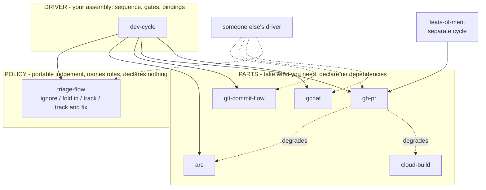
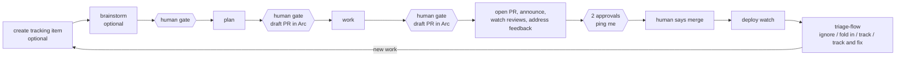

# Claude Skill Plugin Packaging - Plan

## Goal Capsule

**Objective.** Repackage the 23 personal skills in `claude/skills/` as layered Claude Code plugins published from one personal marketplace, split by level — pure capability, opinionated workflow, org orchestration — so teammates can install a layer without inheriting the opinions above it, and a generic subset can be extracted publicly later.

**Product authority.** This plan owns the packaging structure: how many marketplaces, what level each skill belongs to, how plugins depend on each other, and how org-specific configuration separates from portable skill logic. It does not own skill content; no skill body is rewritten beyond moving hard-coded identifiers behind configuration.

**Open blockers.** Two items block planning: final skill-to-plugin membership within the settled level structure, and whether the marketplace lives in `benjfactor/dotfiles` or a dedicated repo. Naming is not a blocker — a marketplace `renames` map makes plugin names reversible. See Outstanding Questions.

## Product Contract

### Summary

Publish the personal skills as a set of small plugins from a single marketplace, organized primarily by level rather than by topic: capability plugins wrap one capability with no workflow opinion, workflow plugins carry personal conventions on top of them, and orchestration plugins compose those into end-to-end runs. Level records composition depth alone; whether a plugin is publishable is tracked separately, so org-specific work sits at its real depth. Org identifiers move behind `userConfig` so the lower layers become publishable without a restructure.

### Problem Frame

The skills currently live in `claude/skills/` and reach Claude Code through a symlink at `~/.claude/skills`. That gives version control and a fast edit loop but distributes nothing: a teammate cannot install a skill, there is no version to pin, and there is no update path. Moving to a new machine made the seams visible.

The skills are densely interlinked — 13 of 23 reference at least one other by name, and `regression-triage` reaches eleven — so any split has to survive that graph rather than cut across it. They are also unevenly opinionated. `send-gchat-message` is a reusable primitive that posts to a Chat space; `notify-pr-channels` is a personal convention about which channels a passing build should reach. Packaging them together forces anyone who wants the primitive to adopt the convention.

### Key Decisions

- **One marketplace, many plugins.** (session-settled: user-approved — chosen over several marketplaces: marketplaces split on trust and ownership, there is one owner, and adding a marketplace is the only friction a consumer ever pays.) Governs R1.
- **Layered plugins using `dependencies`.** (session-settled: user-directed — chosen over a single all-in plugin and over a dependency-free split: the base-and-extension shape is the goal, and the mechanism exists.) Governs R2, R6.
- **Level is the primary split; surface is secondary.** (session-settled: user-directed — chosen over slicing by integration surface alone: surface grouping put opinionated conventions next to the primitives they wrap, and a consumer who wants a primitive should not inherit the convention above it.) Governs R3, R4, R5.
- **Token cost is not a splitting criterion.** Measured always-on cost across all 23 skills is ~1,840 tokens, roughly twice the ecosystem median for one plugin and below its 90th percentile. The split buys selective adoption and publishability, not weight.
- **Optional surfaces stay optional in prose, not in manifests.** Claude Code has no peer or optional dependency, so a hard `dependencies` entry would over-require a consumer whose CI or browser differs. Governs R7.
- **Descriptive plugin names over evocative ones.** Plugin names are the human-facing install decision; the model matches on skill names and descriptions. Governs R8, R15.
- **Names are reversible, so naming does not block.** The marketplace `renames` map migrates an old name to a current one, supports multi-hop chains, and tombstones removals with `null`; the validator rejects dangling targets and cycles. Governs R14, R17.
- **Capability grouping follows the consumer's need, not the vendor's catalog.** A `gcloud` plugin bundling BigQuery and logging would group by billing relationship rather than by anything a consumer wants together. Governs R16.
- **Level is depth, not portability.** Fusing the two pushed org-specific level-2 workflows up to the org level and produced dependencies pointing upward: the PR flow calls `notify-pr-channels`, so that skill sits below it regardless of being Vendasta-specific. Governs R18.
- **Parts, policy, and glue.** The goal is that someone takes the parts they want and writes their own glue, so only glue carries dependencies. Composability is mostly a skill-writing property rather than a packaging one: a skill that names another skill pins an implementation, while one that names an outcome lets any plugin satisfy it. Governs R22, R23.
- **The judgement is the portable asset, not the primitives.** Posting to Chat or opening a browser is trivially reimplemented; the triage decision — ignore, fold into the current work item, or track separately with or without fixing it — is the part worth reusing, and it is reused over someone else's dev flow rather than replaced by their own. It therefore names roles and ends with the fewest dependencies, inverting its current position as the most entangled plugin. Governs R22a.
- **CI is a provider, and the code already says so.** `merge-pr` queries GitHub's status rollup first and escalates to Cloud Build only when a check is still pending, which is a substitutable-provider relationship with a working fallback already in place. Governs R26.
- **Packaging breaks bundled-script paths, independent of grouping.** Five skills invoke scripts through `~/.claude/skills/<name>/`, which exists only because the skills are symlinked; an installed plugin lives under a versioned cache path. Governs R25.
- **Membership is the one decision that hardens at first publish.** Names stay reversible through `renames`; skill moves do not, which is why membership is settled before anything ships rather than after. Governs R19.

Parts and glue, per R22. Parts sit alongside one another and declare nothing; only glue points at them, and a dashed edge is a capability the part degrades without rather than a dependency it declares:

Levels still record composition depth per R18 — capability, workflow, orchestration — and the diagram's arrows are exactly the downward edges that rule permits. Parts and glue is the sharper cut, so it is the one drawn.

The target end state is one driver over parts anyone can use in isolation. The cycle it drives:

### Requirements

**Distribution shape**

- R1. All personal plugins publish from a single marketplace; a second marketplace is added only when a genuinely different trust or ownership boundary appears, such as a public subset under a separate owner.
- R2. Plugins layer through `plugin.json` `dependencies`, so a lower-level plugin installs without pulling in the levels above it.

**Level structure**

- R3. Each plugin sits at exactly one level: capability, workflow, or org orchestration.
- R4. A capability plugin wraps one external tool, carries no workflow opinion, and declares no dependency on another personal plugin.
- R5. A workflow plugin holds personal conventions and depends on the capability plugins whose tools it uses, so a consumer can adopt the capability without the convention built on it.
- R6. Dependency edges point from higher levels to lower levels only; no capability plugin depends on a workflow plugin.
- R7. Where a workflow plugin's use of a capability is optional, it does not declare a hard dependency on that capability's plugin. This covers Cloud Build status for `merge-pr` and `pr-feedback-watcher`, and Arc for `open-pr`.
- R8. Each plugin name describes what it owns, and no name collides with a name in a marketplace already added on this machine. An unprefixed `github` is excluded on that basis.

**Portability**

- R9. The `git-commit-flow` plugin assumes git only and invokes no GitHub tooling, so it is usable on a non-GitHub remote. Skills that shell out to `gh` sit in `gh-pr` instead, including `sync-base` and `worktree-cleanup`.
- R10. Org-specific identifiers move behind `userConfig` rather than remaining literal in skill bodies or bundled scripts. This covers the Chat space ID `AAAAIj8WMWc`, the `@vendasta/meerkats` handle, and the `TEAM_CHANNELS` map.
- R11. Each plugin records which of its skills require org-internal configuration, so a plugin can be published without shipping internal defaults.

**Development workflow**

- R12. Skills stay editable in place during development, with no reinstall step between an edit and the next session using it.
- R13. Marketplace and plugin manifests pass `claude plugin validate --strict` before release.

**Naming and grouping**

- R14. Plugin names are treated as reversible. When a name changes, the marketplace declares the old name in its `renames` map pointing at the current one; a removed plugin is tombstoned with `null` rather than dropped silently.
- R15. Every plugin carries a marketplace-entry `description` stating what a consumer gets and what they must already have installed or authenticated, plus a `displayName` whenever the machine name is not the clearest human label.
- R16. Capability plugins group by the capability a consumer wants, not by the vendor that supplies it. A single vendor's unrelated tools stay in separate plugins.
- R17. Plugin names carry no `-skills` or `-plugin` suffix.

**Level semantics**

- R18. Level records composition depth only — what builds on what. Publishability is a separate per-plugin property, so an org-specific plugin sits at whatever depth its dependencies put it at rather than being pushed to the org level.
- R19. Skill-to-plugin membership is settled before the first publish. A plugin rename is migratable through `renames`, but a skill moving between plugins has no migration path and silently removes the skill from anyone who installed the old plugin.

**Packaging scope**

- R20. Packaging every skill is not a goal. A skill with no distribution need stays unpackaged as a local skill symlinked from `claude/skills/`, and that is a settled outcome rather than an unfilled gap.
- R21. A skill stays unpackaged only when no packaged skill delegates to it, since a plugin that ships a delegation to a local skill hands consumers a reference they cannot resolve.

**Composability**

- R22. Plugins divide into parts, policy, and glue. A part declares no dependency on another personal plugin and degrades when an adjacent capability is absent. A policy plugin carries portable judgement, names the roles it needs rather than the plugins that fill them, and declares no dependency either. Only glue — the wiring of specific parts into those roles — declares dependencies.
- R22a. A policy plugin's dependency count is the measure of whether it is portable. `triage-flow` carries the reusable judgement, so it ends with the fewest dependencies rather than the most.
- R22b. Exactly one plugin is the driver. It owns the development cycle's sequence, its human gates, and the bindings from roles to specific parts, and it is the one plugin where hard dependencies — including cross-marketplace ones — are correct, because installing it means opting into that assembly.
- R22c. The driver closes a loop rather than ending a chain: triage of what deploy surfaces feeds new work back to the start of the cycle. A design that terminates after deploy has lost the property the cycle exists for.
- R22d. The driver's value is its gates and waits, not its steps. Steps already exist as skills; what exists nowhere is the sequencing, the human review points, and the event transitions between them.
- R23. A skill references outcomes, not other skills by name. `merge-pr` requires that CI is confirmed green rather than that `gcp-ci-watch` is invoked, so any plugin satisfying the outcome composes. Six existing cross-references are rewritten to this form.
- R24. No skill references another skill by relative file path. `notify-pr-channels` and `pr-studio-open-in-arc` currently do, and those paths cannot resolve once the skills sit in different plugins.
- R25. A bundled script is invoked through `${CLAUDE_PLUGIN_ROOT}` with a fallback for when the variable is unresolved, never through `~/.claude/skills/<name>/`. Five skills currently hardcode the symlink path, which does not exist for an installed plugin.
- R26. `gh-pr` names no CI provider. The check context is a `userConfig` value defaulting to all checks, so the plugin works on any CI, and `cloud-build` is a precision upgrade rather than a requirement. `merge-pr` currently hardcodes `.context == "ci/cloudbuild"` in its status query, which is the only thing making the GitHub part provider-specific.

### Key Flows

- **Adopting one capability without the workflow above it.** Trigger: a teammate wants to post to a Chat space from Claude Code but does not want personal PR conventions. Steps: they add the marketplace, install `gchat`, and configure their own space ID via `userConfig`. Outcome: no glue plugin is installed, and `notify-pr-channels` never enters their context. Covers R4, R5, R10.
- **Adopting the whole cycle.** Trigger: a teammate wants the full development loop, gates included. Steps: they add the compound-engineering and Vendasta marketplaces first per R2, then install `dev-cycle`, which auto-installs every part and provider it binds. Outcome: the cycle runs end to end and closes back on itself through triage. Covers R2, R22b, R22c.
- **Reusing the judgement over a different dev flow.** Trigger: someone wants the triage decision — ignore, fold in, track, or track and fix — but runs their own pipeline on a different tracker and CI. Steps: they install `triage-flow` alone, which pulls in nothing, and fill its roles from their own driver. Outcome: the judgement travels without the wiring. Covers R22a, R23.
- **Taking parts without the assembly.** Trigger: someone wants the commit and PR mechanics and nothing else. Steps: they install `git-commit-flow` and `gh-pr`, which pull in nothing, and pair them with their own CI provider. Outcome: no personal convention is inherited, and the PR part degrades gracefully without a CI provider present. Covers R22, R26.

### Scope Boundaries

- Skill bodies are not rewritten. The only content change in scope is moving hard-coded org identifiers behind configuration per R10.
- Nothing is published publicly in this pass. R10 and R11 make publication possible later; they do not perform it.
- Whether `temporal-activities` and `pr-studio-open-in-arc` should instead go upstream into the Vendasta marketplace is not decided here. Both overlap plugins that already exist there.
- Release automation beyond R13's validate step is out of scope.

### Dependencies / Assumptions

- Claude Code 2.1.251 accepts `dependencies` in `plugin.json` as an array of strings, auto-installs them, and prunes orphans via `claude plugin prune`. Verified by schema probe against the installed binary.
- `peerDependencies` is not supported; the validator reports it as an unknown field ignored at load time. This is why R7 exists.
- `renames` in `marketplace.json` maps an old plugin name to a target that must be a name in `plugins[]`, another `renames` key, or `null`. Multi-hop chains and `null` tombstones validate clean; dangling targets fail as `target-missing` and cycles as `cycle`. Verified by schema probe. The official marketplace carries nine live rename entries, most stripping a `-skills` or `-plugin` suffix.
- Verified for renames: schema and validation behavior only. Install-time migration — whether a rename rewrites `enabledPlugins` keys in an existing `settings.json` or migrates an already-installed copy — was not verified and needs a real publish to test. The skill invocation prefix does change with the plugin name.
- `description`, `displayName`, `keywords`, `author`, and `version` are accepted in `plugin.json`; `category` is not and warns as belonging in the marketplace entry. All 291 official marketplace entries set `description`.
- A dependency's marketplace must already be added before install; Claude Code will not add one on the user's behalf.
- `plan-commit-to-worktree` depends on the `compound-engineering` plugin and `pr-studio-open-in-arc` on `vendasta-pr-studio`. Both are cross-marketplace, so both hit the constraint above.
- Assumed but unverified: a bare dependency name without `@marketplace` resolves within the declaring plugin's own marketplace. The schema accepts the bare form; resolution was not confirmed.
- `claude plugin init <name>` scaffolds into `~/.claude/skills/<name>/` and auto-loads as `<name>@skills-dir`, which is the candidate mechanism for R12.
- `benjfactor/dotfiles` is a public repository, and the Chat space ID in R10 is already committed there in six files. R10 is cleanup of a current state, not a precondition for a future one.

### Outstanding Questions

**Resolve Before Planning**

- Final membership within the settled structure. The working proposal is seven plugins covering 19 skills: `git-commit-flow` and `gh-pr` as parts; `gchat`, `arc`, `cloud-build` as providers; `triage-flow` as policy; `dev-cycle` as the driver; `feats-of-merit` on its own cycle. See Appendix for the full assignment.
- Repo home: the marketplace in `benjfactor/dotfiles`, which is already public and preserves the symlink dev loop, or a dedicated repo with clean tags and history.

**Deferred to Planning**

- Whether plugin names carry a personal prefix, and the marketplace name. Deferred rather than blocking because `renames` makes names reversible per R14.

- Whether bare dependency names resolve same-marketplace; testable only by publishing.
- Whether `wsu-note`, which invokes no external system and carries no org coupling, belongs in `feats-of-merit` with `wsu` or as a part of its own.
- Which of the six skill-name cross-references can be rewritten as outcomes without losing precision, and which genuinely need to name an implementation.
- The `userConfig` schema shape for R10.

### Sources / Research

- `claude/skills/README.md` — the existing skill-flow mermaid diagram and the develop/ship/deploy chain it documents.
- Surface matrix, cross-reference graph, and proposed level assignment for all 23 skills: see Appendix.
- `~/.claude/plugins/marketplaces/vendasta-dev-agent-toolkit/.claude-plugin/marketplace.json` — in-house precedent: one marketplace, eleven plugins from subdirectories, `defaultEnabled: false` on six, including a personally-named plugin.
- `~/.claude/plugins/marketplaces/claude-plugins-official/.claude-plugin/marketplace.json` — 290 entries; none declare `dependencies` and none use `defaultEnabled`.
- Ecosystem packaging statistics from the local plugin catalog cache: median 3 skills per plugin, mean 7.6; always-on cost median 832 tokens, p90 4,249.

## Appendix

### Proposed level assignment

Plugin names below are provisional; naming is deferred per Outstanding Questions and reversible per R14. This revision resolves the three upward dependencies produced by treating org-specificity as a level, per R18.

| Plugin | Kind | Skills | ~always-on tokens | Depends on |
|---|---|---|---|---|
| gchat | part — provider (comms) | send-gchat-message | 96 | — |
| arc | part — provider (browser) | open-in-arc | 87 | — |
| cloud-build | part — provider (CI) | gcp-ci-watch | 63 | — |
| git-commit-flow | part | green-commits, commit-preferences, plan-implementation-commits, golang-pre-commit-tests | 340 | — |
| gh-pr | part | open-pr, merge-pr, pr-feedback-watcher, sync-base, worktree-cleanup | 407 | — (degrades without cloud-build, arc) |
| triage-flow | policy | regression-triage | 147 | — (names roles, per R22a) |
| dev-cycle | driver | git-worktree-jira-branch, pr-ready, notify-pr-channels, plan-commit-to-worktree | 405 | git-commit-flow, gh-pr, gchat, arc, triage-flow, compound-engineering, vendasta-dev-agent-toolkit |
| feats-of-merit | separate cycle | wsu, wsu-note | 118 | gh-pr |

Seven plugins covering 19 skills. Parts and providers are usable in isolation and declare nothing; `dev-cycle` is the assembly and carries every dependency, including the two cross-marketplace ones.

**`plan-commit-to-worktree` is a driver skill, not a local one.** It performs the cycle's plan-then-review-as-draft-PR gate, so it moves out of the unpackaged set. The rule already written into CLAUDE.md — invoke it immediately after `ce:plan` — is driver sequencing currently living as a global instruction, and it belongs in the driver.

**Unpackaged, per R20.** `vim-rest`, `user-preferences`, and `temporal-activities` stay symlinked local skills, and R21 holds for each because none is the target of a delegation from a packaged skill. `pr-studio-open-in-arc` is also unpackaged; it belongs upstream in `vendasta-pr-studio`, and `temporal-activities` similarly duplicates `vendasta-dev-agent-toolkit:temporal-workflows`.

**Execution risk on the driver.** A skill is a prompt-time instruction and does not durably wait, while the cycle spans days and many sessions. The driver is therefore a set of entry points plus resume logic leaning on `/loop`, background tasks, and push notifications, not one long-running skill. This constrains how the driver is built, not whether the packaging is right.

### Surface matrix

External systems each skill actually invokes, derived by grepping for command and API usage rather than from prose mentions.

| Skill | Surfaces | ~always-on tokens |
|---|---|---|
| commit-preferences | git | 79 |
| gcp-ci-watch | gh, gcloud | 63 |
| git-worktree-jira-branch | git, Jira naming only | 56 |
| golang-pre-commit-tests | git, go | 72 |
| green-commits | git, go | 124 |
| merge-pr | gh, git, gcloud | 60 |
| notify-pr-channels | gh, Chat | 67 |
| open-in-arc | Arc, pr-studio | 87 |
| open-pr | gh, git, Arc, Jira naming | 44 |
| plan-commit-to-worktree | gh, git, Arc, Jira naming, compound-engineering | 143 |
| plan-implementation-commits | git | 65 |
| pr-feedback-watcher | gh, gcloud | 84 |
| pr-ready | gh, git, Chat | 59 |
| pr-studio-open-in-arc | Arc, pr-studio | 85 |
| regression-triage | gh, Arc, Chat, Confluence, go | 147 |
| send-gchat-message | gcloud, Chat | 96 |
| sync-base | gh, git, go | 173 |
| temporal-activities | Temporal | 54 |
| user-preferences | go | 55 |
| vim-rest | vim / rest.nvim | 58 |
| worktree-cleanup | gh, git | 46 |
| wsu | gh, git, Confluence | 68 |
| wsu-note | none | 50 |

### Cross-reference graph

Directed edges are real delegations; backward mentions such as "X delegates here" are excluded. `send-gchat-message` and `open-in-arc` are pure sinks, which is what makes them clean capability plugins.

- Depends on nothing: commit-preferences, green-commits, user-preferences, golang-pre-commit-tests, git-worktree-jira-branch, worktree-cleanup, sync-base, open-in-arc, send-gchat-message, gcp-ci-watch, vim-rest, temporal-activities, wsu-note
- Composes the above: plan-implementation-commits, notify-pr-channels, pr-studio-open-in-arc, open-pr, merge-pr, pr-ready, wsu
- Composes those: plan-commit-to-worktree, pr-feedback-watcher
- Orchestrates across everything: regression-triage
